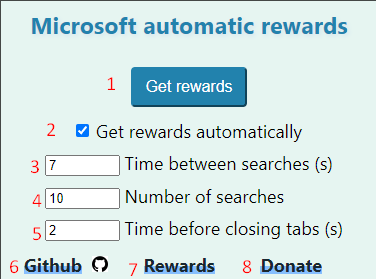
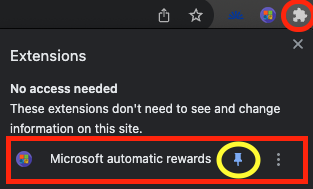

# 微软 Rewards 自动搜索器


充分利用你的微软 Rewards 账号，每天轻松获取积分！

如果你喜欢这个扩展，请在 GitHub 上为它点个 Star！ 

## 下载

[Chrome 应用商店](https://chromewebstore.google.com/detail/microsoft-automatic-rewar/ocmmbfdhomnkljmjkmafegefcgcfkefo)  

[Firefox 附加组件商店](https://addons.mozilla.org/en-US/firefox/addon/microsoft-automatic-rewards/)

[移动端 App](https://github.com/spin311/MicrosoftRewardsWebsite/releases/tag/app)

如果你喜欢这个扩展，请给予 5 星好评，这对我很重要 :) 

## 赞助 

您的赞助能帮助我在业余时间继续免费开发此类工具。任何金额都是巨大的支持！❤️

[](https://www.paypal.com/donate/?hosted_button_id=4WXEWMN3QGLGY)


## 功能特点



1. 在 Bing 中自动打开 10 个随机搜索标签页，加载完成后自动关闭。
2. 每天首次打开浏览器时自动打开搜索标签页（默认开启）。
3. 可自定义标签页打开的间隔时间（单位：秒；设置为 0 则同时打开所有标签页）。
4. 可自定义搜索次数。
5. 可自定义标签页关闭前的等待时间（单位：秒；设置为 0 则加载完即关闭）。
6. GitHub 页面包含完整源代码和文档。
7. 快速访问微软 Rewards 官方页面并登录。
8. [使用 PayPal 或信用卡进行赞助](https://www.paypal.com/donate/?hosted_button_id=4WXEWMN3QGLGY)。



请确保已将扩展程序固定到浏览器工具栏。

## 项目结构

本浏览器扩展基于 [WXT](https://wxt.dev/) 和 React 构建。一套代码库同时生成 Chrome (MV3) 和 Firefox (MV2) 构建版本 — 不再为不同浏览器维护独立的源码树。

```
/wxt                        - 浏览器扩展源码 (WXT + React + TypeScript)
  /entrypoints
    background.ts           - 后台 Service Worker 入口
    /background             - 每日奖励、调度计划、搜索运行器
    rewards.content.ts      - rewards.bing.com 内容脚本
    bingResult.content.ts   - Bing 搜索结果页内容脚本
    /popup                  - 弹窗界面 (React)
    /components             - 共享 React 组件
    /hooks                  - React Hooks (存储管理、搜索进度)
    /utils                  - 搜索、进度、设置及辅助函数
    /data                   - 搜索词库
    /enums, /types          - 共享 TypeScript 类型定义
  /public                   - 复制到构建产物中的静态资源 (图标)
  wxt.config.ts             - Manifest 配置与构建配置
/microsoft_rewards_app      - Android 应用 (Flutter)
/assets                     - 图标源文件 (icon.svg)
/scripts                    - 维护脚本 (图标栅格化处理)
/docs                       - 文档与 README 图片
```

## 开发指南

所有扩展相关的命令均在 `wxt` 目录下运行：

```bash
cd wxt
npm install

npm run dev              # Chrome 模式开发，支持热重载
npm run dev:firefox      # Firefox 模式开发，支持热重载

npm run compile          # TypeScript 类型检查
npm run test             # 单元测试 (Vitest)

npm run build            # 生产环境构建 -> wxt/dist/chrome-mv3
npm run build:firefox    # 生产环境构建 -> wxt/dist/firefox-mv2
npm run zip              # 打包 Zip 文件供商店上传
npm run zip:firefox
```

构建产物存放于 `wxt/dist` 中且**不会**提交到 Git 仓库 — 发布版本会打包上传至应用商店及 GitHub Releases。

加载未打包的开发构建：先运行 `npm run build`，然后在 Chrome 中打开 `chrome://extensions`，开启“开发者模式”，选择“加载已解压的扩展程序”，选择 `wxt/dist/chrome-mv3` 目录即可。

### 遗留代码

WXT 重构之前的旧版本使用了手写的 `chrome/` 和 `firefox/` 源码树并提交了编译产物。该部分代码已从主分支中移除，并保留在 [`legacy`](https://github.com/spin311/MicrosoftRewardsWebsite/tree/legacy) 分支中。主分支上的任何代码均不依赖它。

## 联系方式

如果您有任何建议或疑问，欢迎通过邮件联系我：[spin311pro@gmail.com](mailto:spin311pro@gmail.com)。

祝您愉快获取积分！😊
